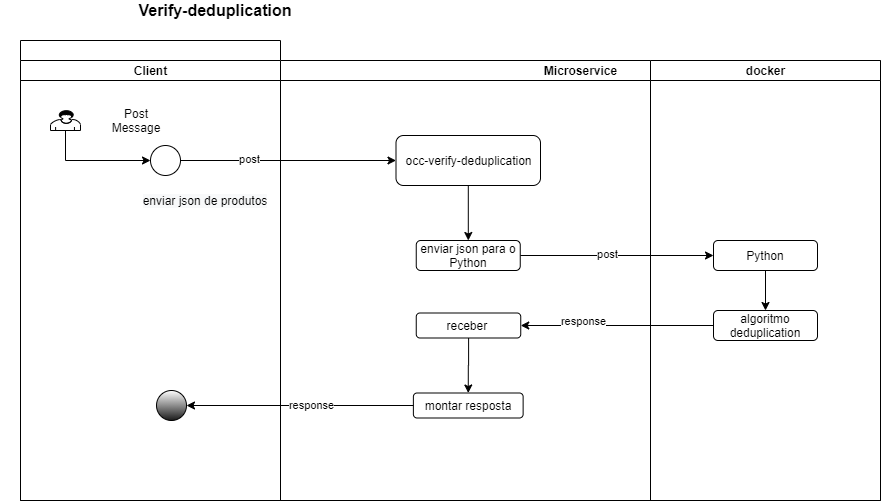

# **Tecnologias utilizadas**
-   Python 3.6

# **Objetivo**
Este microserviço tem a finalidade receber um payload de produtos do catalogo, realizar uma classificação dos produtos para identificação de duplicações, novos produtos e produtos onde é necessário uma validação. 
​
#**Funcionamento**

- Para a execução do algoritmo, é necessário que o payload seja passado na seguinte estrutura:
    {

     "products": [
         {
             "id" : "id do produto",
             "displayName" : "nome do produto"
         }],
    }
            
​- O output do modelo retornará um novo payload para sucesso ou uma mensagem de erro, como demonstrado abaixo:
​
- Mensagem de Sucesso para o deduplicador(exemplo):
```
   "products": [
        {
            "Cosine": 0.8708995729957852,
            "Deduplicated": false,
            "Fuzzy": 88,
            "Human Validation": false,
            "New Product": true,
            "SuggestionProducts": [
                {
                    "displayName": "Kit Chapinha Secador Mondial Escova Modeladora Mondial KT53",
                    "id": "p100000000"
                }
            ],
            "Token": "",
            "displayName": "Kit Chapinha Secador Mondial Escova Modeladora",
            "id": "p1888888",
            "index": 0
        },
```
- Mensagem de Erro para o deduplicador:
```
{
 "O json inserido está em um formato incorreto"
}
```

# **Instalação e deploy da imagem**
- Para o procedimento de instalação da imagem, é necessário os passos a seguir:
1) <b>Docker pull</b>
Realize o comando: 'docker pull 2560joao/deduplicator:dedupe_joao' no terminal para baixar a imagem; 

2) <b>Docker images</b>
Realize o comando: 'docker images ' para localizar o ID da  imagem;

3) <b>Docker run </b>
Realize o comando: 'docker run -d -p 1000:80 (id imagem)' para rodar a imagem;

​
# **Arquitetura**



# <b>Endpoints</b>
Foram disponibilizados dois endpoints do microserviço:

1. **[GET]** - <i> http://localhost:1000/isAlive </i>
Endpoint gera um status ok 200 para garantir a disponibilidade do serviço

2. **[POST]** - <i> http://localhost:1000/dedupe </i>
Endpoint recebe o payload, efetua a classificação, retornando um payload.
​

​
​

​
​
